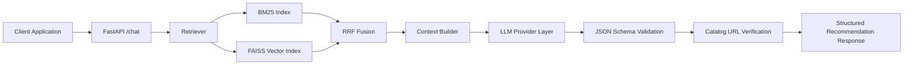

# SHL Assessment Recommendation System

Production-ready conversational recommendation service for SHL assessments, built with a hybrid retrieval stack and a stateless FastAPI backend.

## Product Snapshot

SHL Assessment Recommendation System | Python, FastAPI, FAISS, BM25, RAG, Docker, GitHub

- Built a hybrid retrieval pipeline combining BM25, FAISS, and Reciprocal Rank Fusion (RRF) to improve assessment recommendation quality for conversational user queries.
- Developed a stateless FastAPI backend supporting structured multi-turn conversations using a single LLM inference request with strict JSON output validation and automated recommendation verification.
- Containerized the application using Docker and implemented configurable multi-provider LLM support, enabling deployment across cloud platforms with automated evaluation pipelines.

## Why This Product

Enterprise hiring and talent teams often need fast, relevant, and auditable assessment recommendations from natural language requests. This service is designed to:

- Minimize hallucinations through retrieval-first grounding and deterministic validation.
- Deliver consistent machine-readable output for downstream integration.
- Remain deployment-friendly across cloud environments.
- Support provider flexibility to handle rate limits and cost constraints.

## Core Capabilities

- Hybrid retrieval engine: BM25 + FAISS + RRF.
- Conversational recommendation workflow with clarification, refinement, and comparison support.
- Strict response schema: reply, recommendations, end_of_conversation.
- Catalog-constrained output with URL verification against known SHL entries.
- Stateless API design for horizontal scalability.
- Multi-provider LLM routing (Groq, OpenRouter, Gemini).
- Built-in evaluation workflow for regression and quality checks.

## Architecture

<p align="center">
  
</p>



## End-to-End Request Flow

<p align="center">
  
</p>

1. Client sends full conversation history to POST /chat.
2. Service extracts the active user intent from recent turns.
3. Retriever executes BM25 and FAISS searches.
4. RRF merges and re-ranks candidate assessments.
5. LLM generates a strictly structured JSON response over retrieved context only.
6. Response is schema-validated and recommendations are cross-checked against catalog URLs.
7. Cleaned response is returned to client.

## API Contract

### GET /health

Response:

```json
{"status": "ok"}
```

### POST /chat

Request:

```json
{
  "messages": [
    {"role": "user", "content": "We need assessments for senior leadership hiring."}
  ]
}
```

Response:

```json
{
  "reply": "Based on your requirements, here are the most relevant options.",
  "recommendations": [
    {
      "name": "Assessment Name",
      "url": "https://www.shl.com/...",
      "test_type": "K"
    }
  ],
  "end_of_conversation": false
}
```

## Technology Stack

- Backend: FastAPI, Uvicorn
- Retrieval: rank-bm25, FAISS, Sentence-Transformers
- LLM Layer: Groq, OpenRouter, Gemini (provider-configurable)
- Data Processing: Requests, BeautifulSoup
- Deployment: Docker, Render, Railway
- Evaluation: Custom scripted evaluator with structured output logs

## Local Development

### 1. Install dependencies

```bash
python -m venv .venv
.venv\Scripts\pip install -r requirements.txt
```

### 2. Configure environment variables

Create .env and set:

```env
GROQ_API_KEY=...
OPENROUTER_API_KEY=...
GEMINI_API_KEY=...
LLM_PROVIDER=groq
```

### 3. Run the API

```bash
.venv\Scripts\python -m uvicorn main:app --host 0.0.0.0 --port 8000
```

## Evaluation Pipeline

Run the evaluator:

```bash
set EVAL_BASE_URL=http://127.0.0.1:8000
set EVAL_TURN_DELAY=12
.venv\Scripts\python evaluate.py
```

Generated artifacts:

- eval_output.txt
- evaluation_results.json

<p align="center">
  
</p>

## Deployment

### Render (Docker)

1. Connect repository to Render.
2. Render picks up render.yaml and Dockerfile.
3. Set required environment variables.
4. Deploy and verify GET /health.

### Railway (Docker)

1. Connect repository to Railway.
2. Railway detects Dockerfile automatically.
3. Set required environment variables.
4. Deploy and verify GET /health.

Required environment variables:

- GROQ_API_KEY
- OPENROUTER_API_KEY
- GEMINI_API_KEY
- LLM_PROVIDER

## Security and Operational Notes

- Never commit .env or API credentials.
- Store secrets only in deployment platform environment variables.
- Rotate keys immediately if exposure is suspected.

## Roadmap

<p align="center">
  
</p>

- Domain-level filtering and metadata-aware reranking.
- Enhanced explainability traces for recommendation rationale.
- Expanded analytics for recommendation acceptance and drift monitoring.
